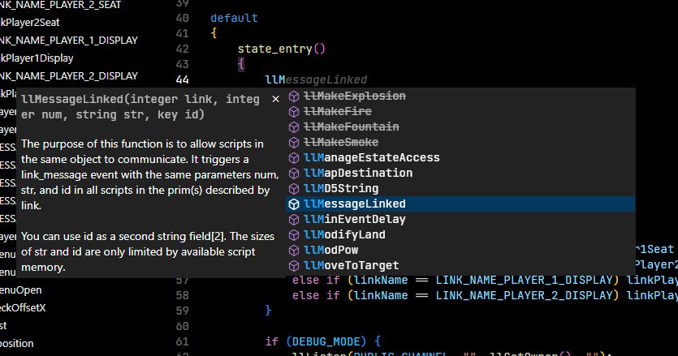
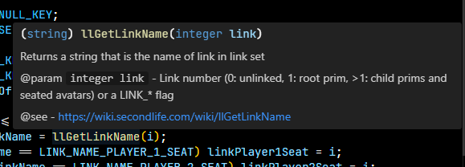
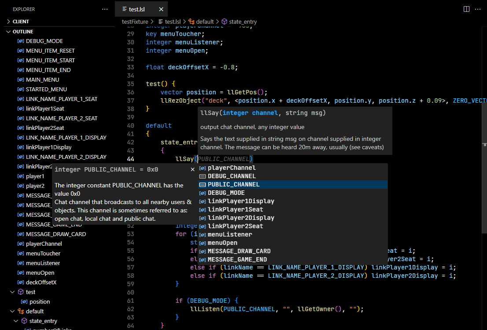
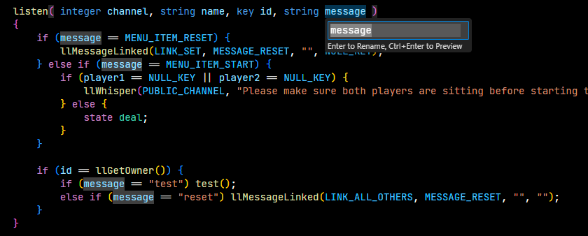

# LSL Language Server
This extension adds support for LSL (Linden Scripting Language).

#### Features
- Syntax highlighting
- Snippets for event handlers
- Hovers with definitions of built-in functions and constants
- Auto-complete for built-in functions and constants
- Signature help
- Type-aware auto-complete
- "Go to Defintion" and "Find References"
- Variable rename support
- Symbols and Outline

#### Screenshots

## Disclaimers
Second Life® and Linden Scripting Language are trademarks of Linden Research, Inc. This Visual Studio Code extension is not affiliated with or sponsored by Linden Research.

## License
[MIT](./LICENSE.md)